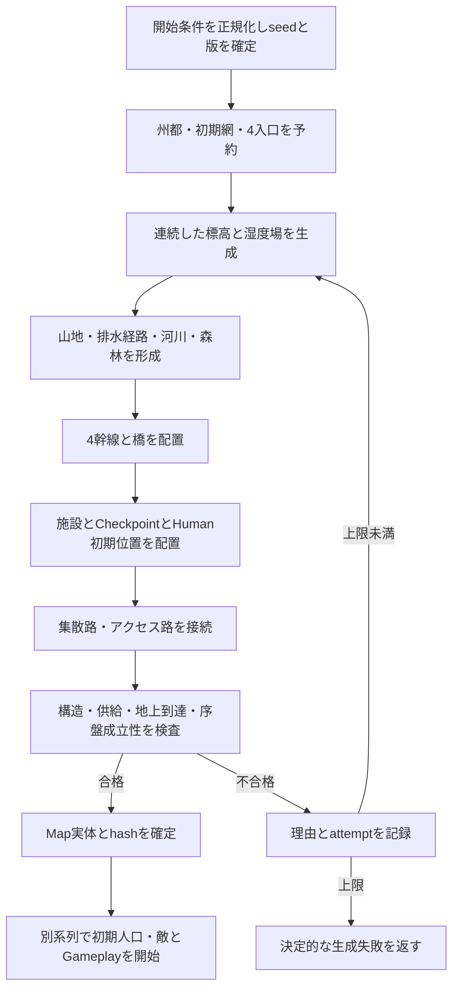

# Nowhere Left to Hide PoC v1.7.0 アップデート要件ドラフト

作成日: 2026-10-03（UTC）  
調査基準: `c26364131afa00531b587720d525f435a60e6a17` / App v1.6.9  
状態: **設計・修整提案。未承認・未実装。初回・リベンジの追送報告を反映済み。**

## 1. 目的・扱い・今回の作業範囲

v1.7.0では従来の固定マップを保持し、同じ51×51ヘックスで、地形・道路・施設配置をseedから再現できるランダムマップを追加する。開始時に固定／ランダムを選択できるようにする。同時に、既存プレイ報告と現行コードを照合し、AIが公開情報を誤読しやすい点と、再現確認が必要な不具合候補を整理する。

本書は新規の要件文書であり、[現行仕様](Nowhere%20Left%20to%20Hide%20PoC%20現行仕様.md)、[v1.6.9確定要件](Nowhere%20Left%20to%20Hide%20PoC%20v1.6.9%20アップデート要件%20確定版.md)を変更しない。本文の「要求」はユーザーから与えられた条件、「推奨案」は採用判断が必要な設計、「未確定」は決定または証拠が不足する事項である。P0はリリース成立に必要、P1は本版で優先、P2は後続でもよい項目を表す。

今回行うのはクラウド環境の静的コード・文書調査、公開一次資料の調査、本書の新規保存だけとする。ゲーム本体実装、依存追加、新プレイ、シミュレーション、再現テスト、GUI検証、branch/worktreeの作成・切替、commit/push/PRは行わない。Windows/T3、および停止を指示されたAstraセッションにはアクセスしない。他環境のパスや記録が本workspaceに存在するとは仮定しない。

### 1.1 読み取った作業指示と証拠の範囲

- `/workspace/nowherelefttohide` のHEADは上記commit、開始時branchは`work`、`git status --short`は空だった。Gitの読み取りとファイル静的解析のみを使った。
- READMEを読み、repo配下・`/workspace`・ルートの適用候補`AGENTS.md`と、repoおよびworkspaceの`.agents`/`.codex`に関連する指示・`SKILL.md`を探索したが、当環境には該当ファイルが見つからなかった。過去引き継ぎ文書の「AGENTS.mdを読んだ」という記載を現在の指示本文の代用にはしない。
- 成果物は既存のMarkdown形式で保存し、本書以外の既存文書を変更しない。
- 主にREADME、PLAY_WITH_AI、現行仕様の地形／供給／公開情報／18.15～18.19、v1.6.9要件・受入記録、過去LLM改善調査、下記コードを読んだ。現行コードとの不一致は黙って解消せず課題として記す。
- 初期施設表の数量・人口・距離はソースの定数を読み取るPython静的集計で照合した。ゲーム初期化やAction実行による試験結果ではない。

## 2. ユーザー要求と提案の対応

| ID | 要求 | 対応案・受入の中心 | 優先度 |
| --- | --- | --- | --- |
| REQ-01 | 既存プレイからAI情報と不具合を整理 | 第4章の根拠台帳。確定事実、静的不整合、未確認候補、プレイヤーミスを区別 | P1 |
| REQ-02 | 同じサイズのランダムマップを追加し1.7.0とする | 51×51、2,601 Hex、既存の地形・移動規則を使用 | P0 |
| REQ-03 | 開始時に固定／ランダムを選択 | UI/CLI/Bridge/Sessionで同一の開始契約。省略は固定 | P0 |
| REQ-04 | seedで固定・再現 | mapSeed、gameplaySeed、generatorVersion、設定、Map hashを保存。乱数系列を分離 | P0 |
| REQ-05 | 全施設の位置はランダム、初期供給内の構成は固定 | 恒久施設8件＋検問所4件の構成を維持する推奨案。州都を含む全施設の座標を生成 | P0 |
| REQ-06 | アメリカ内陸州を想起する連続した地形と遊びやすさ | 平原主体、森林帯、少数の山地、連続した河川・橋・道路。到達性と供給を別検査 | P0 |
| REQ-07 | 商用利用を妨げない参照実装・ロジックの調査 | 第10章の一次資料・LICENSE・依存・帰属一覧。第三者商用ゲームコードは使用しない | P0 |

「全seedで同じ難易度」「勝利可能性が数学的に保証される」「ライセンス上の問題が一切ない」とは主張しない。形状の有効性、序盤成立性、難易度分布、ライセンス根拠をそれぞれ別に評価する。

## 3. 現行マップ・初期供給網の基準

### 3.1 サイズ・地形・道路

- `src/core/map.ts:26`付近: `fixed-51x51-v9`、width=51、height=51。座標はaxialの`q,r=0..50`で、画面上の正方格子ではない。
- `src/core/hex.ts`: 距離は`(|dq|+|dr|+|dq+dr|)/2`、隣接は6方向。配列上の斜め隣接やユークリッド距離を到達性・供給の代用にしない。
- 外周2列は392 HexのHorde Spawn Reserve。内側47×47=2,209 HexがPlayer占有可能領域。Reserveは地形とは別の属性。
- `plain/forest/mountain/water`、基本進入MPは1/2/3/通行不可。道路は既存の水面上の橋を含め進入MP1。山は通行不能壁ではなく高コスト・地上視界遮蔽として扱われる。施設・検問所はUrban、防御補正を持つ。
- 固定十字幹線は州都(25,25)から4方面各25 Hex、十字の`roadTiles`は101 Hex。別に`roads.segments`のcollector/accessがあり、移動上の道路判定は両方を見る。`tile.road`だけを集計すると接続路を落とす。
- 各入口のHorde Spawn Zoneは11×2=22 Hex。Reserve全体と各Waveの配置領域は同じではない。
- 固定地形でも湾・原発、油田、陸軍基地、空軍基地、初期敵等はseed依存。固定モードの名称は「すべての配置がseedによらず同一」を意味しない。

### 3.2 供給の正確な定義

`src/core/supply.ts`の`isInitialSupplyHex`は、州都CからのhexDistanceが`checkpoint.initialSupplyRadius=5`以下であることだけを判定する。初期網S0は中心が盤内にある現行条件で91 Hex。地形・橋・道路の接続・敵の遮断を探索する処理ではない。

拡張供給は各幹線への最短Hex距離でセクターを決め、同距離境界では複数セクターに属する。支線bの供給半径は`max(5, hexDistance(C, activeCheckpoint_b))`。Cから対象Hexまでの距離がその半径以下なら、そのセクターから供給される。**検問所を中心に半径を張る方式ではない。** ActiveがなくてもS0は残る。道路に沿った距離でもない。

現行の4検問所はすべて州都から距離5なので、ゲーム開始時の実供給範囲もS0と一致する。ランダム時に検問所を距離6以上へ置くと初期実供給が拡大し、同じ初期構成と言いにくくなる。そのため推奨案は4検問所を各幹線の距離5上に置く。水面を越えて供給判定が真になることは現行の幾何学的規則から起こり得るため、物理到達性を独立に検証する。

### 3.3 初期供給内の恒久施設（標準UNA/既定Config）

根拠: `map.ts`の`facilitySpecs`、`config.ts`の施設性能・`initialWorkersByFacility`、`state.ts`の`facilityStateFromDefinition`。人数は現行の開始時健常住民または労働者。全8件がPlayer所有、感染者0である。

| ID | 種別 | 現行座標(q,r) | 州都距離 | 初期人数 | 定員 | 本版の構成固定案 |
| --- | --- | --- | --- | --- | --- | --- |
| capital | 州都 | 25,25 | 0 | 51 | 100（都市soft cap） | 1、所有・人数・機能維持 |
| city-1 | 地方都市 | 25,21 | 4 | 0 | 50（都市soft cap） | 1、空の所有都市として維持 |
| farm-1 | 農場 | 23,25 | 2 | 23 | 30 | 1、所有・人数維持 |
| civilian-factory-1 | 民需工場 | 27,25 | 2 | 23 | 30 | 1、所有・人数維持 |
| military-factory-1 | 軍需工場 | 21,25 | 4 | 0 | 30 | 1、空の所有施設として維持 |
| refinery-1 | 製油所 | 25,23 | 2 | 10 | 30 | 1、所有・人数維持 |
| power-plant-1 | 火力発電所 | 25,27 | 2 | 3 | 30 | 1、所有・人数維持 |
| wind-power-plant-1 | 風力発電所 | 26,24 | 1 | 0 | 0 | 1、無人稼働の性質維持 |

合計は**8施設、健全民間人口110人**。人口0の都市・軍需工場も構成に数える。風力は人口0でも通常稼働する。空の都市・軍需工場は施設の存在・所有と稼働を区別する。実際の生産量・給電は既存の経済処理で決まる。

`STARTING_FACILITY_IDS`は6 IDのみを列挙しておりcity-1とmilitary-factory-1を含まない。これを「初期供給内全施設」の正本として流用しない。判定は初期実体＋供給式から行う。

### 3.4 初期検問所

検問所は`map.facilities`に含まれず、`state.checkpoints`で管理する。施設集計だけで要件を満たしたことにしない。

| ID | 支線 | 現行座標 | 州都距離 | 初期状態 |
| --- | --- | --- | --- | --- |
| checkpoint-1 | north | 25,20 | 5 | operational / Active / normal |
| checkpoint-2 | east | 30,25 | 5 | operational / Active / normal |
| checkpoint-3 | south | 25,30 | 5 | operational / Active / normal |
| checkpoint-4 | west | 20,25 | 5 | operational / Active / normal |

waiting/screening/approved/infectedはすべて0、remainingTurns=0、Standbyなし。次回到着Turnはseed依存であり固定値ではない。4方面・方針・初期役割を維持し、到着列の再現はgameplay側の契約で扱う。根拠: `initial-deployment.ts:3`、`state.ts:499`以降。

### 3.5 マップ全体の恒久施設

| 種別 | 全体数 | S0内 | S0外 | 既定定員 |
| --- | --- | --- | --- | --- |
| capital | 1 | 1 | 0 | 100 |
| city | 8 | 1 | 7 | 50 |
| farm | 5 | 1 | 4 | 30 |
| civilianFactory | 4 | 1 | 3 | 30 |
| militaryFactory | 3 | 1 | 2 | 30 |
| oilField | 1 | 0 | 1 | 5 |
| refinery | 1 | 1 | 0 | 30 |
| powerPlant | 1 | 1 | 0 | 30 |
| windPowerPlant | 1 | 1 | 0 | 0 |
| nuclearPowerPlant | 1 | 0 | 1 | 5 |
| armyBase | 1 | 0 | 1 | 10 |
| airBase | 1 | 0 | 1 | 10 |
| **合計** | **28** | **8** | **20** | 検問所4件は別枠 |

油田のnorth/east/south/westは4候補から1件を選ぶIDであり4施設ではない。`FIXED_FACILITY_COUNT=26`は両軍事基地を除いた数で、初期GameStateは両基地込み28件。validatorの一部エラー文に「27 including Army Base」が残るが、実際の数量基準にはしない。

S0外20件は中立で、通常の中立生存者はseed/Map ID/施設IDから1～10人を抽選し定員で制限する。原発はこの既定中立生存者抽選の例外。ランダムマップでも「全中立施設の人数を毎回固定する」という要求はまだない。初期人口の抽選分布、感染既定、報酬期限と報酬内容は維持し、初期網内8件の110人だけを固定構成案とする。

Simple Farm、Relief Supply Center、Civilian Drone Base、Temporary Housingなどの建設可能施設は初期0件。建設風力も初期配置の風力と区別する。今後建てる施設の建設ルールをランダム化する要件ではない。

### 3.6 初期部隊・敵・資源の維持案

- 初期HumanはPolice4、Riot Police1、Recon Team1、National Guard1の7隊、既定Regular。州都周辺の合法配置へ移す。施設をランダム化しても既存の絶対座標定数を残して衝突させない。
- 実際の初期敵はNormal40/Hunter4/Gas4/Screamer2=50体。`map.initialZombiePositions`自体はNormal候補50件を保持し、実配置では40件を使う現行表現であり、総数を二重に数えない。
- Normal候補の州都距離8以上、Hunterの最小距離20、Gasの最小距離9、両基地が各敵の実Vision範囲に入らない制約等を再利用する。ランダム用にはHuman配置を引数化し、固定座標参照を除く。
- Food330、CG355、MG175、Fuel192、製油Allowance2000、Wave日程・強度、原発/空軍基地のTurn10期限、IFV性能は本版の地図追加だけでは変更しない。

## 4. プレイ根拠・AI情報・修整候補

### 4.1 根拠の強さと比較上の限界

以下のSol結果は依頼文および追送された初回・リベンジの全文報告／公開証跡引き継ぎを根拠にする。A/Bのログ・ZIP実体は別executorにあり、本環境で直接読んだ／再生したとは扱わない。受理操作数・エラー種別は追送で明示された定義を採用する。Astraは補助的な途中報告のみである。

| Evidence ID | 受領内容 | 確認範囲・留保 |
| --- | --- | --- |
| PLAY-SOL-1 | GPT6.1SolHigh、v1.6.9、UNA/seed1、T32 capitalLost、232受理操作、103 kills、12 unit loss | 公開obs/query/previewのみの逐次判断。正式Decision拒否0、preview入力エラー1、stale revision2。感染損失287、飢餓死0。formal replay読込・最終seek検証済みとの報告。GUI/Action再実行未検証 |
| PLAY-SOL-2 | 同じSolセッションの反省を使ったリベンジ、同UNA/seed1、T79 capitalLost、602受理操作、214 kills、21 unit loss | 正式拒否0、query123応答、preview728応答、DTO/query入力エラー12、違法preview52、合法だが未到達Move preview13。感染損失1,694、飢餓死36。最終大群159体、同所属撃破3。formal replay最終seek一致・source/git unchangedとの報告。初見ではない |
| PLAY-ASTRA-AUX | 別AstraLow独立run、T26 capitalLost、237操作、100 kills、5 loss | 東崩壊、首都側HP9のPolice死亡→住民4人再感染という途中報告のみ。追加アクセス・再開依頼をしない。主要な不具合断定根拠には使わない |
| PLAY-OPUS-USER | 過去Opus5.5 v1.6.8で70+turn生存とのユーザー報告 | v1.4頃からmemory蓄積あり。version/seed/経験差を統制できず、モデル優劣を比較しない |
| DOC-OPUS-SEP30 | repoの9/30調査文書は別記録のv1.6.8 seed6、T63 capitalLost、594 Decision/588受理/6拒否を記載 | 70+turn報告と同一runとは確認できない。過去資料が元報告の誤読2件を訂正した事実を引き継ぐ |

T32→T79を情報改善・モデル能力・特定戦術の因果効果と断言しない。同一セッションの反省が入り、複数戦術も同時に変わった。敗北は通常のゲーム結果であり技術的不具合ではない。**追送報告の再現確認済みエンジンbugは0件**。今回の静的調査でも新たなゲーム動作bugの再現試験はしていない。初回・リベンジとも正式CLIによる逐次の実プレイであり、built-in Agentや固定方策シミュレーションの結果ではない。

### 4.2 優先修整案

| ID / 優先度 | 根拠・分類 | 修整案 | 受入・再現確認案 |
| --- | --- | --- | --- |
| AI-01 / P1 | PLAY-SOL-1: 供給半径の起点を検問所と誤読。コード上は州都起点 | API静的説明・branch query・checkpoint候補に`radiusOrigin=capital`、州都座標、現在/変更後半径、対象が属するsector、影響施設を一貫表示。簡潔な日本語例を添える | 距離5/6、セクター境界、Active喪失、曲がった道路でCore/Query/UIの供給集合一致。道路経路到達と供給を混同しない |
| AI-02 / P1 | PLAY-SOL-1 T4: 到達previewを見落としGuard HP46→11。プレイヤーミス | 既存ActionSummaryを入口にし、legal、destinationReached、予測/実到達点、停止理由、予測HP/Fuel、残Chargeを短く併記する。`reachable`だけで安全と判断しない公式例 | 合法だが迎撃中断するfixture。summaryだけでも未到達が判読できる。previewエラー時は実行せず、実行後に最新revisionを採用 |
| AI-03 / P1 | attack-candidates照会のunitIdとAttack DTOのattackerId/targetIdを混同 | 候補からそのまま渡せる型付き`action`を追加する案。query用filterとAction DTOを別schema例で示す。AttackHexは`position`を使用 | 各合法候補のactionが同revisionのpreview入力を通る。不正キーは訂正例付きで状態不変拒否。敵/Hex対象と全型を網羅 |
| AI-04 / P1 | T27 Gas爆発でPolice死亡・再感染・発電所連鎖陥落。爆風情報はunits.attackPreviewsにあるとの報告 | `attack-candidates`/ActionSummaryからGas詳細へ直接導線を付け、既存公開Gas projectionを共有。味方致死・施設感染/停止を短く警告する。新たな敵情報は開示しない | 直接致死/非致死、可視Gas連鎖、地上/空中、所有/中立人口を分離。再アニメーション・生成後の連鎖・次敵フェーズは未予測と明示。hiddenだけを変えて公開出力不変 |
| AI-05 / P1 | 初回T15の轢過成功に加え、リベンジT61 B1362行/baseRevision508の予測HP127/Fuel20がB1364行/revision509の実績と一致したのにunexpected_unit_damage | 計算不一致bugとせず、第4.3節のexpectations契約を説明する。停止detailsに判定根拠を出し、正常受理後の注意停止とpreview誤差を区別 | 公開実行入力のexpectationsを確認し、許容HP指定なし／一致／範囲外を比較。停止理由、実状態、再送、残り計画非実行を確認 |
| AI-06 / P1 | 回復率説明とqueryの読み合わせで混乱。静的API説明に例外不足 | Coreの`deriveUnitRecovery`を正本に、rate/baseAmount/回復分類/時点/必要供給/生存条件を統一。移動だけなら常にrestとは書かない | 通常歩兵のmove-only、IFV轢過、ヘリ移動、攻撃/迎撃/自動鎮圧、輸送中、供給喪失、HP上限を確認 |
| AI-07 / P1 | T18感染民需工場回復は成功報告。旧調査でSF奪還不能との誤認があった | v1.6.9で実装済みの未知感染人数null、封じ込め/鎮圧/復旧/再稼働の区別を保持。重複新機能として再提案しない | 所有/未所有、人数既知/不明、駐留可能型、残Charge/MG、復旧Turnの現行回帰を守る |
| AI-08 / P1 | PLAY-SOL-1の入力・revisionエラーは状態不変更との報告 | raw preview CLIとplay-turn envelopeの例を隣接して示す。正しいquery filter、revision再取得、requestId再送の短い手順を提供 | malformed、stale、ルール拒否、accepted、replayedを別集計。State/RNG/正式Decision増分の期待を区別する |
| AI-09 / P1 | リベンジT54 MG0→東Checkpoint喪失→電力620→120、T68人数削減後もMG予測0 | 既存Forecast/Single Point of Failure/維持費/過密/投入不足を読み合わせる短い経済説明とquery導線を整備。供給を失う電源・農場と、現在合法でも維持できない施設を並べる | 供給喪失、StrictのQueue維持費、worker帰還で都市過密が増す局面で、既存Core予測と要約一致。未知の将来損失を確定値にしない |
| AI-10 / P1 | 中継transport.pyでattack/range/movement等を圧縮時に省略したとの追送。ゲームAPI欠落ではない | 公式公開例と短縮表示の保持fieldを明文化。地形軽減後damage/撃破見込み、条件付き反撃、残弾薬、砲兵mode、Gas導線を落とさない | 公開fullと公式compactの同revision意味比較。利用者側ラッパーの改善は外部ゲームソース修正と分ける。既存情報を増設扱いしない |
| AI-11 / P2 | B1362行previewのoverrun2件がexecuted:true。ifv.tsの純粋projectionにも同fieldがある | wouldExecuteまたはpredictedOutcomeへの変更案。既存field維持ならscope=predictionの説明を必須にする | preview呼出前後のState/RNG不変、結果イベントとの区別、旧DTO利用側の移行。単語だけでゲームが既に実行されたと解釈させない |
| AI-12 / P2 | B1465行/revision542: operational/standbyなのにrecovery.ready=false、missing=[not_ruined]。rev545でActivate成功 | 回復のapplicable:falseとnot_applicable_reasonを不足条件から分離。RecoveryとActivateを別表示 | operational/standby/ruined/infectedそれぞれの適用可否。正常検問所を故障・復旧失敗と表示せず、Activation合法性は専用契約で判定 |
| AI-13 / P1 | T77首都に敵がいてもgameOver:false。T79で正式capitalLost | 終局説明を正式result/イベントに結び付ける。首都への敵出現や軍0を単独の即敗北条件と説明しない | 軍0、敵在首都、健康住民あり、感染陥落、healthyCiviliansLostの別局面で既存判定に一致 |
| DOC-01 / P1 | README冒頭は1.6.9だがConfig/保存/公開契約節に1.6.8・Rules18・Save25が残る静的不整合 | 1.7.0更新時にVersion表の単一の出典からREADME/ガイド/API/配布情報を揃える。履歴説明には当時版と付記 | App/Rules/Save/API等を照合する文書チェック。古い互換方針と最新方針を混在させない |
| DOC-02 / P2 | STARTING_FACILITY_IDSの6件と実S0内8件、施設数エラー文が紛らわしい | 現行定数の用途を明確化し、ランダム用の構成manifestは実データから定義。診断文は28件を正確に説明 | 構成表との一致、初期網からcity/militaryFactory/checkpointが脱落しないこと |

### 4.3 IFV停止理由の解釈（bug認定保留）

`src/session/service.ts:412`の`playTurnStop`はAction後に公開HPが減った場合、要求の`expectations.playerUnitHp`のminHp/maxHp内かを判定する。previewの予測値を自動で保存・照合する処理ではない。指定がなければ、予測可能な反撃・轢過の損害でも`unexpected_unit_damage`になり得る。[PLAY_WITH_AI](../PLAY_WITH_AI.md)にもHP許容範囲を明示する契約がある。

追送のT61では損傷5＋20を予測し、HP127・Fuel20の実績が予測と一致している。計算不一致の根拠ではない。実行要求のexpectationsの有無・内容は引き継ぎ本文にないため、本書で「未指定だった」と断定しない。

したがって次を分ける。

1. expectations未指定: 現行契約に沿う保守的な停止。命名・説明・導線の改善候補。
2. 正しい同revisionの許容範囲内なのにこの理由で停止: 実装bug候補。要求・応答と公開前後HPで限定再現する。
3. 許容範囲外、または他Unitが損傷: 停止は妥当かもしれない。自Unitだけで判定しない。

死亡、未到達、新可視敵、危機、Game Over等の既存停止をHP許容で無効化しない。previewと実行の間のrevision変更を許容しない。対応方式は「既存reason codeを残して説明強化」を推奨し、code改名や自動preview承認は互換性と意図確認を別途要する。

### 4.4 静的に見つかった公開説明の注意点

- `apiInfo.ts`のrecovery説明はmove_onlyをrestに挙げる一方、`recovery.ts`はIFVの`activity.overran`とヘリの移動もcombatに分類する。例外不足はコード対照で確認できる。ただし今回のプレイの各回復値が誤っていたとは確認していない。
- `action-candidates.ts`の`friendlyFirePossible`は砲撃projectionから導き、通常攻撃ではfalseになる。Gasの公開爆風projectionは`gas-preview.ts`とunitのattackPreviewsに別途ある。このfalseを「Gasによる味方被害もない」という一般保証に使わせない。fieldのscope明示または共通collateral projection追加を検討する。
- Gas preview自身は、未所有人口、未観測Hex、次の敵フェーズ、再アニメーション・施設Spawn後の影響を予測対象外にしている。T27の全連鎖を現行previewが予測すべきだった、と遡って断定しない。
- v1.6.9で既に追加されたactive不在継続警告、感染人数null、復旧説明、ActionSummary、公開根拠付き報告テンプレートは利用・回帰確認の対象。存在しない機能として再開発しない。
- `ifv.ts:25`の`projectIfvPath`はmover/enemyのコピーを進め、予測で轢過した要素にexecuted:trueを付ける。公開DTO名が紛らわしいことは確認できるが、実GameStateへの実行漏れの証拠ではない。
- `public-entities.ts:543`の`checkpointRecoveryProjection`はstatusがruined以外ならnot_ruinedをmissingへ入れる。正常で回復処理の対象外という意味であり、BのActivation成功と矛盾しない。適用対象外と未成立条件の表示を分ける候補である。

### 4.5 追送の公開証跡参照

以下は**別executorで保存された証跡を識別するためのパス**。当workspaceの実在リンクではなく、今回これらのパスへアクセスしていない。A/Bは親から追送された引き継ぎの参照記号である。

- A: `/workspace/nowherelefttohide/output/Codex_GPT-6.1-Sol_High_2026-10-02/transcript.jsonl`
- B: `/workspace/nowherelefttohide/output/Codex_GPT-6.1-Sol_High_2026-10-02_revenge/transcript.jsonl`
- 各親ディレクトリにはplay-report、requests、公開証拠、replay-verification、integrityがあるとの報告。private Session/checkpointをAI判断の根拠として読む要求はない。

| 論点 | 公開根拠（追送報告） | 分類 |
| --- | --- | --- |
| 初回Move未到達の見落とし | A79行、rev35、event-461～470、Guard HP46→11、停止(26,21) | プレイヤーミス。経路bugではない |
| 初回IFV3体轢破 | A236行、rev97、T15、HP186→126/Fuel100→60 | 実行結果。予測や判断文をkill証拠にしない |
| 民需工場2の回復 | A301行、rev123、event-2219/2220、T18～19回復後に30人配置 | 復旧成功。生産再開時点を区別 |
| 初回電源連鎖陥落 | A517行、rev213、event-4199/4200、T27 | Gas/Police死亡・再感染の実行報告。全因果は未分解 |
| 初回終局 | A566行、rev232、event-5255/5257 | capitalLost、T32 |
| Strictへ変更 | B21～27行、rev6～9、event-9～12、T1 | 4支線。初回はT6 deny |
| 人口移送と救出 | B1177行/rev432/event-7138、B1198行/rev441/event-7185 | T53都市4から68人を首都へ移し機動隊退避。首都過密も増加 |
| 緊急砲撃 | B1250行、rev465、T54 | 敵3体撃破・人口被害13。救援対象Guardは次敵Turn喪失。緊急条件全項目の成立未検証 |
| IFV農場3奪還 | B1362行/baseRev508のpreview→B1364行/rev509実行 | HP127/Fuel20一致。後に補給外・Fuel0・六方包囲、T66喪失 |
| Checkpoint表示/有効化 | B1465行/rev542でoperational/standby/not_ruined。B1477行/rev545/event-9572でActivate | 回復済みだがActiveではない状態を説明する必要 |
| 軍需生産0 | B1503行、rev556、T68で軍需工場1を5人へ減員後も予測0 | 維持・過密・入力不足の読み合わせ。計算bugと断定しない |
| 最終Wave | B1541行、rev572、T70 EndTurn後 | 基本80＋追加79=159体。第1～4波は10/22/19/48で追加なし |
| 最終終局 | B1624行、rev602、requestId=revenge-r601-EndTurn-x、event-14066 | lost/capitalLost、表示T79 |

### 4.6 リベンジの改善と最終敗因

初回に比べ、リベンジは早期denyをStrictへ変更し、砲兵2・Police4・Riot4・IFV1を追加生産した（初回はIFV1/Recon1、砲兵・Police・Riot追加0）。最大供給半径は12→21、fallbackは2→12。T31～36の風力8基とT43原発供給によって生産基盤を拡張し、T50の公開値はCG723/Food5,281/MG409/電力容量620だった（B1085行/rev400）。受入難民121→1,393、最大人口299→1,401と維持負担も大きく変化した。複数変更を同時に行った2回の観測であり、単一戦術の有効性の比較実験ではない。

最終敗因の系列は次のとおり。**直接の終局は首都感染陥落であり、飢餓だけで敗北したという要約はしない。**

1. T54/rev451（B1219行）でMG0。CG551/Food5,330/電力620は残存していた。
2. T54→55の東Checkpoint喪失と供給・電力悪化。rev469（B1258行）で電力620→120、CG0/MG0。T55/rev470（B1262行）で火力要員20へ戻す対応は悪化後だった。
3. T59/65/68の退去計386人とT68減員でも軍需生産は戻らず、最終Wave追加79が確定した。退去の内訳ごとの追加寄与を今回独自に再計算したわけではない。
4. T72→73/rev585（B1573行）で電力容量120/必要170、Food0。供給喪失・敵侵入・感染・生産停止が重なった。
5. T77/rev599（B1612行）でHuman0、健康人口141。rev601（B1620行）で首都健康34/感染88。rev602で正式capitalLost、表示T79。

感染損失1,694、飢餓死36、部隊損失21は最終統計。資源不足が感染管理を悪化させたことは示唆されるが、各感染の不足・過密・敵攻撃の寄与は分離していない。施設奪還と持続稼働、現在の生産余剰と補充余力、Strictによる審査感染防止とQueue維持費を別々に説明する改善根拠とする。

追加確認で、EndTurn後と同revisionの次start（550/585/590/594/599）は資源/phase/砲兵状態が一致したとの報告がある。再開不整合bugとして扱わない。T49のDrone出撃（B1081行/rev398/event-6254）は空軍基地人口0でもoperational/suppliedだった。「無人口なら不可能」という推測からbug認定しない。通信ラッパーのBrokenPipe等は同Session再開で回復し、ゲームsource/進行の不具合とは区別する。

### 4.7 観戦Artifactの検証範囲

| 項目 | 初回 | リベンジ |
| --- | --- | --- |
| 正式ZIP名 | Codex_GPT-6.1-Sol_High_2026-10-02_seed1_replay.zip | Codex_GPT-6.1-Sol_High_2026-10-02_revenge_seed1_replay.zip |
| bytes | 8,239,202 | 26,112,200 |
| Decision | 232 | 602 |
| 最終seek | gameOver=true / lost / T32 | gameOver=true / lost / T79、最終602、公式応答一致 |
| SHA-256 | a3900e1c62b537665f5e12507b0e82180aa291fc6d79d83d6fd975f85794256a | 5d3b93f1f9c778dca102d8fae4955f34890a462873e610569db9392456e0299c |

これは追送報告の検証結果。両方とも公式ReplayPackage読込・最終seek済みであり、**保存Actionのエンジン再実行による決定論検証、GUIのZIP選択・画面・音・演出、他seed/scenarioは未実施**。今後の1.7.0互換fixture候補だが、現在本workspaceへ転送されたものではない。

## 5. 初期構成とランダム配置の推奨契約

### 5.1 「構成」の採用候補

**推奨: 座標以外の初期機能構成を保持する。** 種別・数量・安定した施設ID・所有・初期人数/感染・定員・生産性能・報酬/期限・初期Checkpoint役割を保持し、座標、道路形状、周囲の地形を生成する。全体28施設＋検問所4件、S0内8施設＋4検問所、S0外20施設を不変条件とする。

初期経済が同じになるよう、給電設定、資源、初期部隊、施設の列挙順と`securedOrder`も維持する。座標順で施設を並べ替えて、供出・配電等の同順位処理を意図せず変えない。ランダム油田は方角名と実配置が食い違わないよう、random modeの安定IDを`oilfield-1`にする案を推奨し、Configの既存4候補IDとの扱いを決定する。固定modeのIDは変更しない。

この解釈はユーザーの「構成」を具体化した案であり、まだ確定仕様ではない。「種別・数量だけ固定」「所有/初期人口も固定」「相対配置も固定」のどこまでかを第12章で決める。相対配置まで固定すると位置ランダム化の幅が小さくなるので、距離帯・成立条件だけを課す案を推奨する。

### 5.2 配置制約

1. 州都もランダム対象とし、中央(25,25)からHex距離3以内の安全な候補に置く案。州都を中央固定とする代案は「全施設ランダム」の例外になるため黙って採用しない。
2. S0の8施設は半径5内の別Hex。初期部隊7隊・検問所4件の予約を先に確保し、初期重複を避ける。施設の下地はplain。中立20施設はS0外へ配置し、同一Hex重複とReserve上への配置を禁止する。
3. 4幹線の距離5にCheckpointを各1件配置する。支線IDとCheckpoint IDは安定させ、normal/Active/人数0を維持する。
4. 全恒久施設・Checkpointに、Playerの実移動規則で州都側から辿れる地上経路を用意する。単なる道路描画の接触や直線距離だけでは合格にしない。
5. S0には初期占有・全道路overlay・施設・Checkpoint・Reserveを除いて**少なくとも12 Hexの建設可能plain**を残す案。現行の簡略validatorより厳密に、初期7部隊とconnector roadも除外する。少数の袋小路だけに集中させない。
6. 初期施設群をGas隣接爆風で一括喪失しやすい極端な密集にしない。全施設の最小距離2を一律強制すると既存の近接構成と異なるため、稼働中の重要生産施設同士の隣接数と首都周辺の隘路を検査し、許容閾値は生成試験前に設定IDへ固定する。
7. 陸軍基地・空軍基地・原発・油田の距離帯を別に設ける。現行の陸軍基地は距離6、空軍基地7、原発16。新マップではまずArmy6～9、Air7～10、原発12～18、油田10～18を候補帯とするが、**未測定の提案値**である。到達Turn/Fuel/補給可能性を併せて検証し、帯だけで期限内確保可能とはみなさない。
8. 中立都市・農場等を4方面へ大きく偏らせない緩い配置quotaを設ける。各方面の数量完全対称、全seedの均等難易度は要求しない。候補選択、失敗理由、拒否率を記録する。

### 5.3 供給到達性の別検査

各施設fについて、担当セクターの幹線に合法なPlayer側Checkpoint候補pがあり、`hexDistance(C,p) >= hexDistance(C,f)`を満たすことを少なくとも静的に検査する。曲がった幹線の最近傍セクター・同距離境界は実Core供給関数で判定する。S0外の施設が「地上到達可能だが、どのCheckpoint位置からも供給不能」になる配置は棄却する。

これに加え、将来のテストでは初期敵を除いた明示的な検証fixtureで、偵察→幹線視界確保→建設/移設という合法手順と費用を検証する。このfixtureは**地理・視界・費用の成立性**を調べるもので、通常敵配置での生存や全施設同時制圧を保証するものではない。全マップの隅まで供給可能にする要求ではなく、全恒久施設が供給拡張の対象になれる要求を推奨する。

## 6. 地形・河川・道路の生成案

### 6.1 表現方針

架空のUNA内陸地域として、広い農耕平原、河川沿いの森林、まとまった森林帯、少数の連続した高地/山地、内陸河川や小規模貯水湖、州都と地方都市を結ぶ幹線・支線を組み合わせる。実在州の正確な再現や地質シミュレーションを要求しない。海岸を必須とせず、既存の水面・橋表現で内陸らしい景観を作る。固定modeの湾は維持する。

新しい戦闘地形種、渡河Action、橋破壊、船舶、標高による戦闘補正は1.7.0の必須範囲に入れない。生成内部では標高・湿度を使っても、ゲームルールへ出す地形は既存4種と道路/橋で構成する。

### 6.2 生成手順（推奨）

1. **標高・湿度**: 2D低周波ノイズの複数octaveと少数の帯状ridgeを組み合わせる。ヘックスの実投影座標を使い、q/r軸のサンプル間隔の違いが人工的な縞を作らないようにする。閾値境界、量子化精度、座標投影定数、丸め順をgenerator versionで固定する。
2. **平原・山地**: 平原を主体にし、高標高帯を連続した山地へ分類する。単一Hexのcheckerboard状ノイズは近傍平滑化・最小成分サイズで抑える。ただし全マップを単色にするほど強い平滑化はしない。山地には通過可能な峠や道路を通す。
3. **河川**: sourceからsinkへ6近傍で連結した経路を作り、標高同値時は安定したtie-breakを使う。浅い窪地は決定的な排水補正または明示した湖へ接続し、無限ループ・孤立水1Hex・途中で消える川を防ぐ。合流後に下流を共有し、分流を無制限に増やさない。盤端への流出口または湖の流出口を明示する。
4. **水面表現**: 1.7.0ではriverをwaterのHex列として表現する案を推奨する。辺上の細い川は既存水面判定と別ルールが必要になるため代案扱い。全地図を切断する大河には道路上の橋と迂回経路を設ける。初期網を渡河不能に分断しない。
5. **森林**: 河岸の湿度と大きな森林patchを組み合わせる。山地/森林の連続成分を統計化し、地上視界を遮る性質と地形防御を既存Coreで確認する。
6. **道路**: `roads.ts`の既存重み付き探索、district、collector/accessを参考に、4幹線を先に確定して全施設を接続する。川を道路作成で無差別にplainへ変換せず、橋として連続性を残す。隣接Hexごとの道路接続を正とする。
7. **幹線制約**: 4方面は別々の入口・非交差の単純路とし、州都以外で同じ幹線Hexを共有しない案。首都から外へ距離が減る折返しを避ける。これにより`getBranchIdAt`の「最初の一致」を原因とする曖昧なCheckpoint所属を防ぐ。collectorの横連結は可能でも新しい到着方面にはしない。
8. **入口保護**: 入口を各辺の角から5 Hex以上離す。22 HexのSpawn Zoneを盤内Reserveに確保し、全Spawn可能Hexから地上敵が内側へ進める。Horde入口と川の競合は再生成または明示した橋配置で解消する。
9. **修復**: 施設・初期網の保護予約を優先するが、地形を後から大量に削って合格させない。変更Hex数・橋数・再配線回数に上限を設け、超過はattempt棄却。修復順序も固定する。

### 6.3 数値プロファイル案と品質指標

試作開始用の仮プロファイルは「plain55～75%、forest15～30%、mountain5～15%、water2～8%」。分母は全2,601 Hex、道路・施設overlayの下地地形を数え、合計100%となる同時条件として判定する。これは米国内陸州の実測割合でも現行値でもなく、**採否と調整が必要なゲーム用の提案値**である。

地形率だけでは合格にしない。最大森林/山地成分、孤立成分数、河川のsource/sink接続、橋数、重要施設間の地上最短MP/Fuel、各入口から州都への最短経路、S0の合法建設余地、Supply拡張到達率、通路幅と単一橋依存を測る。保護領域を除いた見本32マップの目視で連続性・縮尺・道路の自然さを確認する。許容閾値は本実装前のプロトタイプ評価で決め、同じgenerator versionのまま後から変えない。

### 6.4 プレイ可能性の意味

- **必須の有効性**: 欠落・重複なし、部隊配置合法、施設構成一致、全施設への地上アクセスと供給拡張可能性、4方面Hordeが水面に封鎖されない。
- **序盤の成立性**: 初期経済を壊さない、重要施設とCheckpointの視界/移動/建設手順が存在する、Turn10期限に対して地形だけで必ず失敗する配置を排除する。
- **難易度評価**: 敵配置・選択・経験を含む結果分布を測る。全seed同等難易度や、敵込みで必ず期限達成・必勝を保証するものではない。バランスが偏る場合は地図制約の問題とAI方策の弱さを区別する。

## 7. seed・乱数・決定性

### 7.1 保存する開始条件

開始descriptor案は`scenarioId, mapMode, rootSeed, mapSeed, gameplaySeed, generatorId, generatorVersion, generatorSettingsId, generatorSettings, attemptIndex, mapContentHash, configVersion, buildId`。実装時に型・名称を確定する。

- 通常UIは従来同様のseed入力1個と固定/ランダム選択にする。既定でmapSeed=gameplaySeed=rootSeed。比較実験向けの個別seedはAPI/advanced設定の任意入力案とし、普段の開始を複雑にしない。
- seedは現行の安全な整数範囲を維持する。負数・0・2^32境界・最大/最小safe integerの受理/拒否と正規化を明文化する。新random系では整数全文の正規decimal表現をdomain入力に使う案。32bit PRNGへの写像は衝突し得るため、異なるseedが必ず異なる地図になるとは約束しない。
- 「ランダムseed」ボタンはUI境界で1回だけseedを決め、その値を表示してからCoreへ渡す。Core生成中に時刻、Math.random、暗黙の再抽選を使わない。
- 同一scenario/mapMode/mapSeed/generatorVersion/settingsから静的Mapが一致する。ゲーム全体の再現にはさらにgameplaySeed、Rules、Config、Build、Action列が必要。

### 7.2 乱数系列の分離案

| 系列 | 主用途 | 独立性の要求 |
| --- | --- | --- |
| map/terrain | 標高・湿度・ridge | gameplay RNGを消費しない |
| map/hydrology | source、排水tie-break | terrainの不要な乱数呼出追加で勝手にずれないようdomain分離 |
| map/layout | 州都、施設、Checkpoint、Human配置 | 種別/IDごとの安定domainを検討 |
| map/roads | 幹線、橋、任意の接続候補 | 再生成や修復がgameplay系列に影響しない |
| gameplay/init | 初期敵・中立人口・到着初期値 | map完成後に独立初期化。Mapの候補集合の変化は結果に影響し得る |
| gameplay/main | Wave・避難民・敵行動等 | 現行の状態保存可能なRNG契約を保持 |
| gameplay既存domain | artillery、感染等 | 各機能が既存に持つ分離を保持し、rootと版を明示 |

現行`SeededRng`はxorshift32-v1、`nextInt`はrejection sampling。`state.ts`は同じRNGで基地→初期敵→一部人口/到着等を進めてからsnapshotを保存する。油田・湾・中立生存者・砲兵・感染には別domainが既にある。単に地形生成をこの既存rngの手前へ挿入すると、その後のゲーム乱数をずらすため不可。

推奨は、random modeを完全分離し、固定modeはlegacy初期化の出力と乱数snapshotをそのまま再現する専用経路で維持すること。固定経路の既存RNG順序を一般化のついでに変更しない。固定も内部オブジェクトを分離する場合は、legacyセットアップから得るゲーム開始snapshotが旧版と一致することを条件とする。既存版とrandom版の同じ数値seedで敵やWaveが同じになる約束はしない。

domain derivationの文字列形式・エンコード・整数overflow・hash方式・0 seed対応を`seed-derivation-v1`として固定する。候補はcanonical JSON配列をUTF-8化した既存系FNV-1a等の明示アルゴリズム＋uint32化であり、テストベクトルを先に用意する。hash衝突がないとは扱わない。Map内容の検証用hashはSHA-256等を使い、生成seed用の軽量hashと役割を分ける。

### 7.3 失敗・再生成の決定性

attempt=0..63の最大64回を仮案とする。各attemptのseedを`[mapSeed,generatorVersion,settingsId,attempt,domain]`から導く。候補の走査順、施設割当順、隣接順、コスト同値時の順位、repair順、失敗判定順を固定する。並列完了順や処理時間で最初の成功を選ばない。

最初の有効Mapを採用し、採用attemptと品質診断を保存する。64回すべて失敗したら`map_generation_failed`と再現キー・失敗分類を返し、既存ゲームとSaveを変更しない。勝手に別seedへ変更したり固定マップへ切り替えたりしない。失敗後のseed変更はユーザーに見える操作とする。公開エラーには非公開敵配置の具体値を出さない。

失敗が一定terrainや施設配置を排除することによる**採択バイアス**を測る。全試行の提案分布と採択分布、失敗理由別率、attempt分布、地形/方角/重要施設距離ごとの偏りを保存する。検証seed群で失敗0でも全整数seed成功の証明とはしない。最大64回の時間と成功率が実用的かは未測定であり、上限変更はsettings/generator版変更として扱う。

## 8. 開始UI・公開API・保存・Replay

### 8.1 開始契約

- UNA開始画面に「従来の固定マップ」「ランダムマップ」を追加。固定を既定にして従来操作を保持する。PRH/ACの利用不可状態とUNA導入文を維持する。
- `resolveScenario`は現行ではUNAにseed以外のConfig overrideを禁止する。mapModeは生のConfig overrideとして通すのではなく、明示した開始引数として許可・検証する。UNAの経済/性能設定変更をついでに許可しない。
- customゲームにもmapModeを渡せる案。ただし半径・配置人数などが構成条件と矛盾するcustom Configは、理由付きで開始前拒否する。「標準UNAの構成保持」をすべてのcustom設定へ強制しない。customの対応範囲はD-03で決める。
- CLI例案は`new --scenario=una --seed=1 --map-mode=random`。この引数は**現行には存在しない提案**。Bridge/reset、Live/WebMCP、AgentGame、Session、Batch runnerも同じresolverを通す。
- 続きから・load・checkpoint再開は保存済descriptor/Mapを使い、現在の開始画面選択で地図を再生成しない。生成失敗・キャンセル時は既存ゲームを維持する。
- 390×844で選択・seed・説明・開始ボタンが操作可能。生成中表示、入力エラー、再現キーのコピー導線を設ける。AI応答に導入文や装飾を混入させない。

### 8.2 公開境界

API/Observation/Compact/Context Handoff/終了報告にmapMode・seed・generatorVersion・Map識別子を必要な範囲で保持する。静的地形・道路・施設を公開する範囲は現行のMap契約を引き継ぐ。初期敵座標、潜伏感染者数、PRNG内部snapshot、未確定Waveは公開descriptorに入れない。

公開Map hashは**静的な公開Map投影だけ**を対象とする。`map.initialZombiePositions`や非公開人口をhash入力に含めた値を公表して、非公開候補の照合オラクルにしない。完全初期状態の検証hashはprivate保存/開発検証に分離する。Seed自体が既存公開であることと、AIへ新たにHidden状態を渡してよいことは別であり、Fair Play境界を維持する。

Map/QueryのキャッシュをmapIdだけで共有しない。現行supplyのmap object/content由来キャッシュは参考にし、地図切替・同seed別settings・保存復帰で誤再利用しない。候補のcursor/revisionは現行と同じ契約を守る。

### 8.3 保存方式・互換性の推奨案

**Map実体＋再現descriptorを保存し、load時に最新generatorで生成し直さない。** 2,601 Hex、施設、道路、橋、branch、Reserve、初期配置定義と必要なsnapshotを含む。現在位置・建設後施設と初期静的Mapを混同しない。

validatorを固定用canonical検証とrandom用構造/descriptor検証に分ける。`validateFixedMap`のtemplate条件を緩めてrandomを通さない。random保存ではサイズ、座標、6近傍道路、数量、S0構成、生成版/設定、hashの一致、現在状態の整合を確認し、不正時は現状態不変で拒否する。hashだけを信頼境界や適正Map証明とみなさない。

| データ | 推奨方針 | 未確定・注意 |
| --- | --- | --- |
| 新1.7.0固定/ランダムSave | 保存実体から再開。RNG全系列/Config/descriptorを保持 | schema確定後にformat versionを更新 |
| 1.6.9通常Save/Session/Checkpoint | 現行プロジェクトの方針に合わせ非破壊拒否を第一案とする | 移行が必要なら専用converterを別要件にする。自動アップグレードしない |
| 1.6.9公開Artifact | 読取専用の観戦互換を維持する案を推奨 | v1.6.9は従来もっと古い版を拒否している。対応する旧schema readerとfixtureが必要。未実装の対応を約束しない |
| 1.7.0公開Artifact | Map実体と公開frame/deltaを同梱し観戦。最新generator不要 | 実行Replayとは別にpackage read/seek検証する |
| 将来のgeneratorVersion | 登録済版だけ明示対応。未対応は非破壊拒否 | 同じseedを最新generatorへ黙って読み替えない |

Artifactの「観戦最終seekが一致」と「ActionをCoreで再実行し全状態が一致」は別の検証である。本書のプレイ報告は前者の報告を後者の証拠へ拡張しない。

### 8.4 Version管理

現行の実値はApp1.6.9 / Rules・State・Config19.0.0 / Fixed Map v9 / Save26 / Agent・Observation・Bridge24.0.0 / Artifact23.0.0 / Checkpoint・Session20.0.0 / Action4.0.0 / Action Summary1.0.0 / Query1.2.0 / AiSession1.5.0 / Play-turn1.3.0 / Store1.0.0 / Package2.0.0。

1.7.0の候補はApp1.7.0、Rules/State/Config20、Save27、Agent/Observation/Bridge25、Artifact24、Checkpoint/Session21。**これは実装前の仮番号であり、現行コードの値でも確定公開契約でもない。** Action/Query/Summary/AiSessionは開始引数と追加fieldの差分に応じて版を決める。外枠Store/ZIPを維持できても内部schemaの検査は省略しない。

固定Map ID `fixed-51x51-v9`は形状・配置契約を維持する限り変更しない。random Map系列ID案は`random-51x51-v1`、generatorId案は`inland-hex`、generatorVersion案は`1`。Map IDと内容hashを区別し、同系列IDの異なるseedを同じMapと誤認しない。

## 9. コード接続箇所と段階実装案

本章は将来の実装計画であり、今回コードを変更する指示ではない。

| 段階 | 作業・主な対象 | 完了条件 |
| --- | --- | --- |
| 0: 根拠・仕様確定 | 本書のD-01～D-10、追送報告の再現fixture化計画、構成manifest、seed正規化、schema差分、ライセンスscope | 未確定の扱いを決定。固定mode基準と受入fixtureの計画を承認 |
| 1: 固定経路保護 | `types.ts`, `map.ts`, `state.ts`, `initial-deployment.ts`, `scenarios.ts`にmode境界を設計。既存固定経路を独立維持 | 固定配置・RNG順・既定開始を変えない比較試験が先に成立 |
| 2: 生成器の独立作成 | random Map module、terrain/hydrology/layout、汎用road入力、validateGeneratedMap | Core/UIに依存しない同seed Map生成。構造・構成・連続性・到達性試験が合格 |
| 3: 開始と初期化の統合 | `state.ts`、Human/敵配置候補、domain RNG、Config、報酬/経済順序 | 全入口の同じ開始条件から同じ初期状態。UNA override禁止の例外が限定的 |
| 4: 保存・観戦・実行Replay | `save.ts`, `invariants.ts`, `engine.ts` LoadSnapshot、Session store/artifact、`replay/package.ts` | Map実体保存、非破壊拒否、分岐再開、最終seek、再実行一致 |
| 5: UI・公開契約・AI説明 | `controller.ts`, Browser/Live/WebMCP、Agent API/Query/Observation、採用するAI-01～13、日英文書 | 390px/PCの開始選択、情報導線、Hidden境界、revision操作の整合 |
| 6: 評価・受入 | 第11章の大量生成、限定fixture、対照Batch、目視、文書/NOTICE確認 | 全必須受入が成功。測定値・失敗・未検証範囲を記録して1.7.0判断 |

### 9.1 特に見落としやすい固定依存

- `state.ts:456`、`config.ts`、`save.ts`、`invariants.ts`、`engine.ts`のLoadSnapshot、`replay/package.ts:95`は固定Map ID/validatorを前提にする。
- `map.ts`の基地候補、湾template、初期Zombie seed再検証、`initial-deployment.ts`のHumanとCheckpointは絶対座標に依存する。
- `roads.ts`の`fixedOilFieldSpurs`は油田IDから固定接続座標を選ぶ。random油田にそのまま適用すると非隣接道路になる。汎用access生成と固定専用spurを分ける必要がある。
- `fixedRoadInput`のlayoutSeed=0、4幹線の25 Hex前提、`hordeEntrance.roadTiles`と`branch.roadTiles`の向き、Spawn Zone生成を点検する。random幹線長は25固定にしない。
- `apiInfo.ts`は`FIXED_MAP`から静的Map情報を返す。現在のMapと利用可能generator catalogを混同しない形にする。
- `FixedMap`という型名と`runBase.fixedMap`という保存field名を一度に無差別改名しない。互換readerとschemaを設計してから、共通Map型＋mode別metadataへ移す。
- UI/route/AIの戦略Map/Checkpoint候補/cacheに固定中心・方向・道路を暗黙使用する箇所を横断検索する。Agentの戦術性能改善は、Mapを正しく読む修整と分ける。

## 10. 参照コード・ロジックとライセンス調査

確認日: 2026-10-03。下記は作者・公式repoのREADME、LICENSE、package manifest、該当ソースを根拠にした候補評価。ブランチURLの内容は変わり得るため、実際の採用時にはtag/commit・配布tarball・hash・同梱LICENSEを固定して再照合する。今回は依存をインストールせず、外部コードをrepoへ取り込んでいない。

### 10.1 候補比較

| 候補 | 用途・適合性 | ライセンスと帰属 | 依存・コピーレフト | 提案 |
| --- | --- | --- | --- | --- |
| [simplex-noise.js](https://github.com/jwagner/simplex-noise.js)、manifest4.0.3 | JS/TSの2Dノイズ。既存51×51 hexを実座標でsampleし、標高/湿度へ利用 | [LICENSE](https://github.com/jwagner/simplex-noise.js/blob/main/LICENSE)はMIT。著作権・許諾文を複製/相当部分に保持。ソースヘッダーのJonas Wagnerおよび由来記載も保持する案 | [package.json](https://github.com/jwagner/simplex-noise.js/blob/main/package.json)はruntime dependenciesなし。alea等はdevDependencies/README例であり採用必須ではない。確認したMITにソース公開型コピーレフトなし | **第一候補**。既存SeededRngを専用domainで関数注入し、Math.random既定を使わない。河川/施設/到達性は別途自作 |
| [FastNoiseLite](https://github.com/Auburn/FastNoiseLite)、JS manifest1.1.1 | OpenSimplex2/Perlin/Cellular、fractal/domain warp。地形形状の選択肢が多い | [root LICENSE](https://github.com/Auburn/FastNoiseLite/blob/master/LICENSE)および[JSソース](https://github.com/Auburn/FastNoiseLite/blob/master/JavaScript/src/FastNoiseLite.ts)はMIT。rootの2020、JSの2023等の既存noticeとContributor/port creditを削らない | [JS package.json](https://github.com/Auburn/FastNoiseLite/blob/master/JavaScript/package.json)にruntime dependenciesなし。TypeScript/pngjs等は開発用。MITのコピーレフトなし。全言語・demoを一括で取り込む監査はしていない | 代替候補。小規模2Dだけなら第一候補が簡潔。特定JS実装/版でクロスruntime決定性を検証してから採用 |
| [Red Blob Games mapgen2（JavaScript版）](https://github.com/redblobgames/mapgen2)、manifest2.0.0 | 高さ→排水→河川→湿度→biomeの段階設計。[rivers.js](https://github.com/redblobgames/mapgen2/blob/main/rivers.js)と[moisture.js](https://github.com/redblobgames/mapgen2/blob/main/moisture.js)が参考。Voronoi/triangle前提なのでhexへ丸ごと導入しにくい | [LICENSE](https://github.com/redblobgames/mapgen2/blob/main/LICENSE)はApache-2.0。対象ソースにもApache表記。再配布LICENSE、改変表示、該当著作権/帰属notice、存在するNOTICEの継承が必要。特許条項・商標非許諾も確認する | [manifest](https://github.com/redblobgames/mapgen2/blob/main/package.json)/[lock](https://github.com/redblobgames/mapgen2/blob/main/pnpm-lock.yaml)に複数依存。Apache本体にソース公開型コピーレフトなしだが、全依存の採用版監査は未完 | **ロジック参照候補**。海岸・polygon描画・UI/画像を採用せず、排水と湿度の考え方をhexに実装。コード移植するなら対象範囲のApache条件を履行 |

simplex-noiseの[公式README](https://github.com/jwagner/simplex-noise.js#using-a-seed-value)は既定Math.randomとPRNG注入を説明し、major版で出力が変わり得ることも示す。generatorVersionにライブラリ版を結び付ける根拠となる。自前PRNGを注入するためaleaを追加依存にしない。

FastNoiseLiteはnoiseの部品であり、河川の接続・道路・施設配置・戦略的公平性を生成する完成品ではない。どちらのnoise候補も「大戦略と同じ生成アルゴリズム」の根拠ではなく、本作独自の生成器を構成する候補である。

### 10.2 Mapgen2の依存確認と未完了範囲

公式lockはprng=commit`1104cf92f9824d71cf631eeeedd5866e9b62ea9f`、delaunator5.0.1、poisson-disk-sampling2.3.1、simplex-noise2.4.0、url-search-utils0.2.0を示す。推移依存はhash-int1.0.0、moore1.0.0、robust-predicates3.0.2。内部dual-meshもある。

| 対象 | 今回確認した一次資料 | 確認結果・限界 |
| --- | --- | --- |
| dual-mesh | [同梱manifest](https://github.com/redblobgames/mapgen2/blob/main/dual-mesh/package.json)、[LICENSE](https://github.com/redblobgames/mapgen2/blob/main/dual-mesh/LICENSE) | Apache-2.0。dev側にdelaunator/poissonあり |
| @redblobgames/prng | [公式repo](https://github.com/redblobgames/prng)、[LICENSE](https://github.com/redblobgames/prng/blob/master/LICENSE) | Apache-2.0本文を確認。採用commit実体との最終一致確認は残る |
| delaunator | [公式LICENSE](https://github.com/mapbox/delaunator/blob/main/LICENSE) | ISC。著作権/許諾文保持。現行mainとlock5.0.1の同一性は未確認 |
| poisson-disk-sampling | [公式LICENSE](https://github.com/kchapelier/poisson-disk-sampling/blob/master/LICENSE) | MIT。著作権/許諾文保持。lock2.3.1実体の最終監査は残る |
| simplex-noise2系 | [masterのmanifest](https://github.com/jwagner/simplex-noise.js/blob/master/package.json)、[LICENSE](https://github.com/jwagner/simplex-noise.js/blob/master/LICENSE) | 2.4.0/MIT。4系と出力・APIを同一視しない |
| robust-predicates | [公式LICENSE](https://github.com/mourner/robust-predicates/blob/main/LICENSE) | Unlicense。商用を含む利用記載あり。採用版との一致、地域ごとのpublic domain扱いは別途確認 |
| hash-int / moore / url-search-utils | 上記公式lockで依存関係・版を確認 | 全3件の採用版LICENSE実体・通知条件までは今回未確認。**Mapgen2全体導入の法的確認完了とはしない** |

Mapgen2全体を入れる必要はない。第一案はsimplex-noiseの限定導入＋既存hex/探索＋本作の制約生成。代案は外部runtime依存を追加せず自前のvalue noise等を作ることで、同じ受入テストとgenerator版管理を要求する。外部コードの変数名だけ変えて独自実装と呼ぶ扱いはしない。

### 10.3 採用時の必須記録

採用ファイル/版/取得元URL/hash、LICENSE全文、著作権notice、移植・変更箇所、runtime依存と配布対象の依存、NOTICEの有無を記録し、`THIRD_PARTY_NOTICES`と配布物へ反映する。MIT/ISC/Apache-2.0は確認した本文上商用利用を許す根拠があるが、個別権利侵害の不存在やすべての法域での結論を保証するものではない。未確認依存・画像・記事本文を同じ許諾で利用できるとはしない。

本作自身は[LICENSE](../LICENSE)でPolyForm Noncommercial、[追加許諾](../ADDITIONAL_PERMISSIONS.md)と[素材条件](../ASSETS_LICENSE.md)を持つ。**採用する部品が商用利用可能でも、本作/派生ゲーム全体の販売を自動的に許可する変更にはならない。** 本依頼は外部部品の選定条件であり、repo全体の再ライセンス要求とは解釈しない。

## 11. 受入基準と検証計画（すべて将来実施）

今回、新プレイ・テスト・build・Replay再実行は行っていない。以下の件数・閾値は計画値で、成功済み証拠ではない。まず構造試験で生成失敗を分離し、その後ゲーム検証を行う。

### 11.1 必須受入マトリクス

| Test ID | 検証対象 | 合格条件 |
| --- | --- | --- |
| MAP-01 | 固定/ランダム選択 | UI/CLI/Bridge/Session/Batchの全入口で選択が保存される。省略は固定。無効modeは状態不変拒否 |
| MAP-02 | 寸法・Reserve | 51×51、2,601一意Hex、外周392、Player内側2,209。欠損/重複/範囲外なし |
| MAP-03 | 全施設・初期網 | 第3章の28恒久施設＋4Checkpoint、S0内8＋4、S0外20。容量/所有/人数/初期役割が一致 |
| MAP-04 | 全施設の配置ランダム性 | 固定の全施設座標への焼き付けがない。seed集合で州都を含む各施設の許可領域内に複数座標が現れる。異なるseed全部が異なることは要求しない |
| MAP-05 | 初期配置の合法性 | Human7隊/実敵50体の既定構成、占有・水面・Reserve・安全距離・基地Vision除外が成立 |
| MAP-06 | 地上接続 | 各恒久施設/Checkpointへ実Core移動costで有限経路。4入口のSpawn Zoneから敵が内側へ進める |
| MAP-07 | 供給拡張 | 各施設に供給できるCheckpoint候補あり。合法手順fixtureで偵察・費用・建設/移設条件を別確認 |
| MAP-08 | 初期経済・建設余地 | 初期資源/人数/配電設定/列挙順を保持。少なくとも12合法候補plain。孤立供給だけで生産を保証したことにしない |
| MAP-09 | 河川・地形連続性 | 河川の経路/合流/流出口が整合、断片化と無限循環なし。地形率/成分/橋/修復量が承認profile内 |
| MAP-10 | 幹線・支線 | 6近傍接続、各辺入口、25固定長の撤廃、Checkpoint所属の曖昧さなし、22 Hex Spawn Zone維持 |
| DET-01 | 同seed再現 | 新規プロセス、別locale、別オブジェクト列挙入力で正規化後Map hash一致。Map metadataも一致 |
| DET-02 | map/gameplay分離 | Map生成呼出・失敗attempt・preview表示を増減させてもgameplay初期RNG snapshotを消費しない。gameplaySeedだけ変更しても静的Map一致 |
| DET-03 | seed境界 | 0/負数/2^32近傍/safe integer境界の規定動作。NaN/Infinity/小数/危険整数を開始前拒否 |
| DET-04 | 再生成・失敗 | 各不合格理由を強制したfixtureで同じattemptと結果。最大回数で確実終了し、Save/RNG/現ゲーム不変。暗黙fallbackなし |
| DET-05 | runtime横断 | クラウドLinuxのNodeとブラウザ、対応対象のJS runtimeで同じMap hash。浮動小数閾値境界は専用fixtureで確認 |
| SAVE-01 | 通常保存 | 両modeの保存往復でMap/descriptor/全RNG/現在状態が一致。loadが最新generatorを呼ばない |
| SAVE-02 | Session/Checkpoint | 再開・分岐後の同Action列が継続実行と一致。Mapを取り違えず親状態は不変 |
| SAVE-03 | 非互換/破損 | 旧Save、未知generator、hash改変、不正道路/施設、Config不整合を非破壊拒否。自動保存も旧枠を保護 |
| REP-01 | 公開観戦 | 両modeのArtifact読込、先頭/中間/最終seek、Live/Replayの同Map・表示・件数。旧1.6.9 readerは対応を選んだ場合必須 |
| REP-02 | Action再実行 | 記録のRules/Config/Map実体/gameplaySeed/Action列から全Step digest/event一致。観戦seek成功で代替しない |
| FIX-01 | 固定map退行 | 固定seedの全地形/道路/施設/初期配置/初期RNG snapshotが基準版と一致。乱数順を変更しない |
| FIX-02 | 固定gameplay退行 | 既存Action fixtureのCore状態/Eventをversion等の意図したmetadata差を除き照合。公開説明追加とルール差を分離 |
| AI-TEST-01 | 供給・DTO・移動 | AI-01～03の短い公式例で正しいDTO/到達判定が可能。全候補のactionとpreviewの一致 |
| AI-TEST-02 | Gas/IFV/回復 | AI-04～06の限定fixture、予測scope、expectations、HP/Fuel/感染/回復時点を照合 |
| AI-TEST-03 | 既存改善保持 | active不在警告、null感染、回復条件、入力拒否/再送/状態不変、ページングと省略件数の回帰 |
| AI-TEST-04 | 経済・圧縮・DTO意味 | AI-09～13の限定fixture。既存能力/軽減後damage/弾薬/モードを落とさず、prediction/executionとnotApplicable/missingと終局を区別 |
| PUB-01 | Hidden非漏洩 | 非可視敵/中立感染/未確定Waveだけを変えた2状態で公開候補/summary/診断が不変。公開Map hashにHiddenを含めない |
| UI-01 | UI | 390×844/PCで開始2種、同seed再開始、load/Replay、日英説明、移動・供給overlay・川/橋を判読可能 |
| LIC-01 | 配布 | 実際に採用した版のLICENSE/依存/帰属/改変/NOTICEが配布物とTHIRD_PARTY_NOTICESに一致 |

### 11.2 生成器の大量検証

CI短縮群は固定seed1～100＋境界・既知失敗fixture。リリース前群は1～10,000と、事前に固定して別保存した散在seed1,000件を提案する。連続seedだけでなくdomain hashとの偏り、地形/配置の採択率を調べる。これはゲームプレイではなくMap生成専用試験とする。

記録するものはseed、generatorVersion、settings hash、attempt、失敗分類、Map hash、地形比/成分、橋数、道路長、S0余白、施設距離と各方角quota、主要経路MP/Fuel、生成時間p50/p95/max、メモリ、終端成否。各群の件数・除外・技術失敗を明示する。失敗seedを集計から除いて成功率を見かけ上上げない。

暫定目標は試験群の生成不能0、全採択Mapのhard invariant違反0、timeout0。ただし達成しても全seedを証明したことにはしない。性能目標は対象クラウドLinux環境を記録し、例えば生成p95≤2秒・max≤5秒を検討するが、現時点では未測定・未確定。timeoutは試験失敗の検出にだけ使い、generatorが時間制限で別の地図を返す設計にしない。

### 11.3 難易度・遊びやすさの評価

固定とランダムを混ぜず、標準UNA・同Rules・同Agent版・同設定を明示する。第1段階はrandom100 mapSeed×gameplaySeed3個×Random/Balancedの計2方策（計600ゲーム）程度を候補とし、予算が小さければ事前固定した縮小群を使う。各結果を勝敗、到達Turn、期限施設到達/確保、人口/資源、kill/loss、技術失敗、未終局打切りに分ける。打切りは敗北にも成功にも数えない。

このBatch計画は将来実装後のもので今回実行しない。Turn100上限は測定都合でゲームルールのTurn上限ではない。Final Waveが70でも終了は70に限らないため、必要に応じ150等の上限を事前設定する。生存TurnだけでなくT10以前の地形起因の詰み、4方向の攻撃距離差、橋一点依存、重要施設距離帯別の分布を見る。

施設到達の簡略fixtureと通常敵込みの成績を混同しない。地図制約を直す前に敵弱体化・IFV強化・Horde日程変更で数値を合わせない。外部LLM評価を行う場合は、初見/既存memory/反省ありを分け、同seed群と同じ情報入口で報告する。

### 11.4 将来の実行順序

1. pure generatorとseed/構成/道路/地形validatorの限定試験。
2. 初期状態・Supply・視界・経済・期限Objectiveの限定fixture。
3. 保存/再開/Session/観戦/Action再実行と固定退行。
4. 公開境界とAI修整fixture、UI/CLI/Bridge/Liveの開始契約。
5. `npm run typecheck`、適切なVitest群、`npm run build`、Bridge/Portable Linux smoke。
6. 大量生成、登録したseed群のゲーム評価、GUIの実操作、ライセンス/文書の最終照合。

本タスクではWindows/T3を使わない。将来リリース全体の対応プラットフォーム確認をこのクラウド調査の成功範囲へ含めない。既存の受入記録にあるWindows実績を1.7.0の検証済み証拠として転用しない。

## 12. 採用前の決定事項

| ID | 未確定点 | 推奨案 | 他案・決定の影響 |
| --- | --- | --- | --- |
| D-01 | 「構成」の範囲 | S0の8＋4について種別/数量/所有/人数/定員/性能/役割維持。全体28も維持 | 種別/数量だけなら初期経済と難易度が変わる。相対位置固定ならランダム性が弱まる |
| D-02 | 州都・検問所の位置 | 州都も中央安全域内でrandom、検問所は4幹線の距離5 | 州都固定は「全施設」の明示例外。検問所半径可変は初期供給範囲・構成を変える |
| D-03 | custom Config | UNAは固定構成を厳守。customは別profileとして検証可能な範囲だけ対応 | randomをUNAだけに限定すれば初版実装は小さくなる |
| D-04 | 河川表現 | water Hex＋既存road bridge。海なしの内陸profile | 辺河川/新渡河規則は大幅なルール追加。湾をrandomでも必須にすると内陸表現と衝突 |
| D-05 | 重要施設距離・成立性 | 第5章の距離帯を仮値とし、MP/Fuel/供給/期限fixtureで確定 | 期限や報酬を変える場合は地図追加と別のバランス要件が必要 |
| D-06 | RNGとseed公開 | UI1 seed、内部map/gameplay分離。固定はlegacy再現、randomは新domain | 全modeを新しいRNG順へ統一すると固定退行条件を満たさない |
| D-07 | 旧版互換 | 1.6.9継続は非破壊拒否、公開Artifactは専用readerで観戦を維持する案 | 観戦も拒否するなら明示決定が必要。Save移行は別converterと検証が必要 |
| D-08 | generator候補 | simplex-noise限定導入＋独自hex制約。Mapgen2はロジック参照 | FastNoiseLiteも候補。全Mapgen2採用は依存監査未完で保留 |
| D-09 | 品質profileと失敗処理 | 制約/最大64attempt/明示エラーをversion化。silent fallbackなし | 成功保証のための決定的fallbackは分布を偏らせるため採用時に別集計が必要 |
| D-10 | 表示候補の採否と再現範囲 | Sol追送反映済み。AI-05/11/12は実行bugとせず、説明/DTO改修の採否と互換方針を決める | T61要求expectations実体は未照合。再現テストは今後の計画であり、新プレイで穴埋めしない |

特にD-01、D-02、D-04、D-07は実装の広さと互換性を左右する。決定待ちでも今回の要件ドラフト作成は完了できるが、本書を確定仕様として自動実装しない。

## 13. 根拠ファイル一覧と今回の成果物検証

| 論点 | 主要なローカル出典 |
| --- | --- |
| 正本・既存公開ルール | [README](../README.md)、[現行仕様](Nowhere%20Left%20to%20Hide%20PoC%20現行仕様.md)、[PLAY_WITH_AI](../PLAY_WITH_AI.md) |
| マップ・施設・初期配置 | [map.ts](../src/core/map.ts)、[initial-deployment.ts](../src/core/initial-deployment.ts)、[config.ts](../src/core/config.ts)、[state.ts](../src/core/state.ts)、[bay.ts](../src/core/bay.ts) |
| 地形・道路・供給 | [hex.ts](../src/core/hex.ts)、[terrain.ts](../src/core/terrain.ts)、[roads.ts](../src/core/roads.ts)、[supply.ts](../src/core/supply.ts)、[engine.ts](../src/core/engine.ts) |
| 開始・乱数 | [scenarios.ts](../src/core/scenarios.ts)、[rng.ts](../src/core/rng.ts)、[public-health.ts](../src/core/public-health.ts)のdomain方式 |
| AI情報と停止 | [service.ts](../src/session/service.ts)、[action-summary.ts](../src/core/action-summary.ts)、[action-candidates.ts](../src/core/action-candidates.ts)、[gas-preview.ts](../src/core/gas-preview.ts)、[recovery.ts](../src/core/recovery.ts)、[apiInfo.ts](../src/agent/apiInfo.ts) |
| API入力・query・移動 | [action-input.ts](../src/agent/action-input.ts)、[query-contract.ts](../src/agent/query-contract.ts)、[route-query.ts](../src/agent/route-query.ts)、[types.ts](../src/agent/types.ts) |
| 保存・互換 | [save.ts](../src/persistence/save.ts)、[invariants.ts](../src/core/invariants.ts)、[package.ts](../src/replay/package.ts)、[Session types](../src/session/types.ts) |
| 既存検証・過去調査 | [v1.6.9受入](../validation/v169-acceptance.md)、[9/30 LLM調査](v1.6.9%20LLM改善調査%20引き継ぎ%202026-09-30.md)、[報告テンプレート](../validation/play-report-template.md) |
| 第三者ライセンス | 第10章の一次URL、[既存THIRD_PARTY_NOTICES](../THIRD_PARTY_NOTICES)、[本体LICENSE](../LICENSE) |

今回の検証は、参照ファイル存在、文書リンク、構成数量の静的集計、HEAD/branch/既存追跡ファイルの不変、本書の新規作成を確認する文書検査に限る。ゲーム動作や将来の受入項目が成功したという意味ではない。Library保存の成否・IDは最終返答に記す。